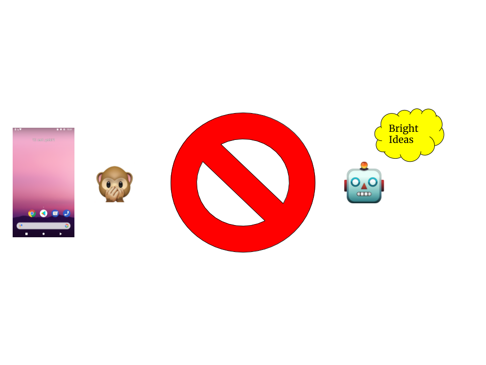
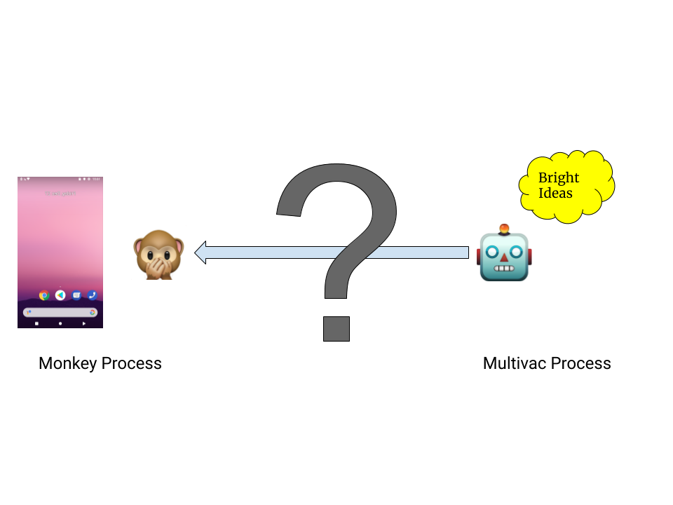
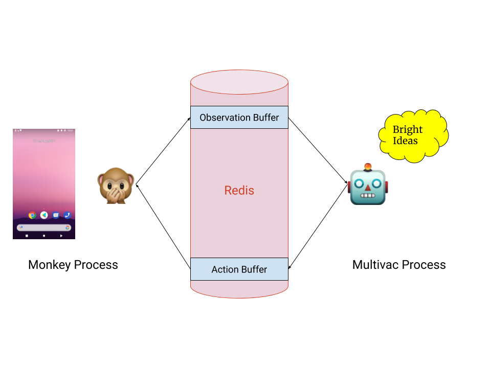

# Multivac: RL Agents that Operate a Smart Phone
Have you ever seen a baby play iphone or Android games before they can 
speak or walk? It's pretty incredible. It's hard to imagine
they have a grasp on what to achieve operating a phone, but 
they become engrossed regardless.

Taking this as some basic inspiration, we look to provide an 
environment and preliminary experiments with launching RL
agents on an Android device. More specifically, the action space 
is 2 dimensional continuous down and up actions on the screen; the observation
space is simply a screenshot of the screen once the action has been taken. The reward
and design of the agent? That's left to experimentation. The project is called Multivac: a name found in
Isaac Asimov's [The Last Question](http://www.physics.princeton.edu/ph115/LQ.pdf).


## Quickstart
Current setup is involved and assumes familiarity with the Android SDK; we are 
currently working on dockerizing this environment for quicker startup.

There are two separate environments to consider:
1. Requirements by the Gym environment and agent side.
2. Requirements on the `jython` side regarding the process that is started using the `monkeyrunner` cmd.

Step by step instructions for setup:
1. Clone the repository locally.
2. Set up a python3.5 virtual environment for the project and activate the environment.
3. Install all requirements listed under `requirements.txt` to this virtualenv.
   This can be done by, `pip install -r requirements.txt`. Once this has been completed,
   setup for the Gym environment and agent side has been complete.
4. Download the Android SDK if not already. There should be the `monkeyrunner` tool under
   `/Sdk/tools/bin/monkeyrunner`. Note the path to the `monkeyrunner` tool,
   denoted `$MONKEYRUNNER_PATH` hereafter.
5. Unzip the `jythonCompatibleRedis.zip` located in this repo. This zip contains
   the `redispy` version `2.10.6` source with some syntax modifications to be
   compatible with `jython`. Note the path to the unzipped source, denoted
   `$REDISPY_PATH` hereafter.
   
Now, here are the instructions for running:
1. Connect an Android device either through USB or open an emulated device through
   Android Studio.
2. Ensure the current working directory is right under `Multivac/` and the virtualenv
from setup is activated. Then, launch the `session_starter.py` script as follows:
```bash
export PYTHONPATH="${PYTHONPATH}:$(pwd)" &&
python session/session_starter.py --monkeyrunner-path $MONKEYRUNNER_PATH --redispy-path $REDISPY_PATH --environment-name $ENV_NAME --agent-name $AGENT_NAME --num-train-steps $NUM_TRAIN_STEPS --num-inference-steps $NUM_INFERENCE_STEPS --observation-delta $OBS_DELTA
```
For a detailed description of all the parameters, run `python session/session_starter.py -h`.
An example to launch a random agent for `50` inference steps using a basic reward function can
be found below:
```bash
export PYTHONPATH="${PYTHONPATH}:$(pwd)" &&
python session/session_starter.py --monkeyrunner-path $MONKEYRUNNER_PATH --redispy-path $REDISPY_PATH --environment-name MeanPixelDifferenceEnv --agent-name random --num-train-steps 10 --num-inference-steps 50 --observation-delta 1000
```

## Design
The infrastructure behind this project involved putting together puzzle pieces
that initially were not meant to be put together. [monkeyrunner](https://developer.android.com/studio/test/monkeyrunner)
is a tool meant for Android developers to automate testing of applications (as per the name). 
OpenAI's [Gym](https://gym.openai.com/) is a common interface for reinforcement learning
environments so that a variety of RL tools and agents can be seamlessly integrated right
off the bat. The fundamental problem is that the low level component of `monkeyrunner` and
the Android device all run on the JVM, specifically `jython`. On the other hand, Gym 
and the algorithms that the agents use will best be suited for `python3.*` with scientific `C`
libraries like `numpy` and `tensorflow`. A bridge between the two is not immediately clear.


The solution we propose is to treat the two components as two parallel processes.
We term the process that runs `monkeyrunner` as the Monkey Process. It is in charge
of placing down and up touch actions on the device/emulator along with taking screenshots.
The process that runs the Gym environment along with the agents that come up with educated 
decisions as the Multivac Process. The Multivac is the brains behind the operations while
the Monkey carries the actions out. However, the communication bridge between the two is still not immediately
clear.


We utilize [Redis](https://redis.io/), specifically [redispy](https://github.com/andymccurdy/redis-py)
in order to implement this communication bridge. Taking advantage of the fact that 
`jython` can adopt `python` compatible data structures, we abstract notions of 
`Action` (2 dim float coordinates) and `Observation` (image bytes) data structures.
Furthermore, we introduce the notion of an `ActionBuffer` and `ObservationBuffer`. These
abstract away underlying redis queues part of the same redis client. The flow is as follows:
1. The Multivac process comes up with an `action` to take. In the `step()` fn of 
   the `Gym` subclass, this `action` is placed into the `ActionBuffer`.
2. The Monkey process carries out a blocking read on the `ActionBuffer`. Once an `action`
   arrives, it parses out the contents and takes that action on the device.
3. After a predefined amount of time, termed `observation_delta`, the Monkey process
   takes a screenshot of the device and wraps the bytes into an `Observation` object.
   It places this `observation` into the `ObservationBuffer`.
4. The Multivac, still in the `step()` fn has placed a blocking read on the `ObservationBuffer`.
   Once an `observation` arrives, it computes a reward and returns.
Steps 1-4 all happen in the duration of one `step()` call of the Gym environment
within the Multivac process. Once 4 ends, the Multivac will make its next decision,
and the cycle continues. In a clean fashion, the Multivac instructs the Monkey on
what to do, and the Monkey continually supplies observations for the Multivac to make
decisions.


## Current Rewards and Agents
WIP

Current basic reward is the mean absolute pixel difference between successive frames.
